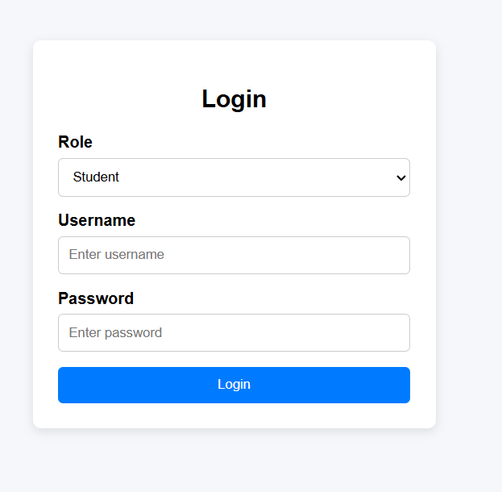
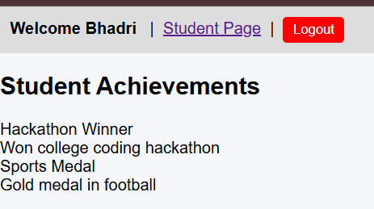
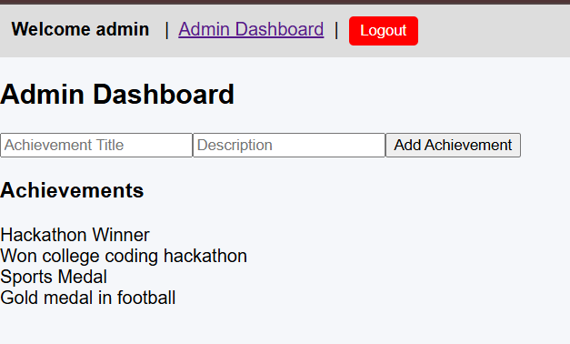

# 🎓 Student Achievements Portal

A simple Student Achievement Management Portal built using **React**.  
This application allows **students** to view their achievements and **admin** to add/manage achievements.

---

## 🚀 Features

### 👨‍🎓 Student Portal
- Login as student  
- View list of achievements

### 👨‍💼 Admin Portal
- Login as admin  
- Add achievements (Title & Description)  
- View all achievements  
- Logout functionality  

### 🔐 Authentication
Role-based login:

| Role | Username | Password |
|------|---------|---------|
| Student | student | student |
| Admin | admin | Admin@123 |

> Password change popup appears for admin on first login (simulated security message).

---

## 📸 Screenshots

### 🔑 Login Page  


### 🧑‍🎓 Student Dashboard  


### 🛠️ Admin Dashboard  


> Ensure screenshots are stored as:
screenshots/login.png.png
screenshots/student-dashboard.png.png
screenshots/admin-dashboard.png.png

yaml
Copy code

---

## 🛠️ Tech Stack

- **React.js** (Frontend)
- Local Storage for authentication & data
- CSS-based UI styling

---

## 📂 Folder Structure
student-achievements/
└── src/
├── components/
├── data/
├── App.js
└── Login.js

yaml
Copy code

---

## ▶️ Run Locally

```bash
npm install
npm start
Runs at:

arduino
Copy code
http://localhost:5030
🌐 Deployment
You can deploy this project using:

✅ Netlify

✅ Vercel

✅ GitHub Pages

🎯 Project Purpose
Developed as part of 2nd year Engineering learning project to practice:

React components

State & props

Role-based auth

LocalStorage usage

🤝 Contributing
Feel free to fork & improve! 🚀

⭐ Support
If this helped you, please ⭐ the repo on GitHub!

👤 Author
Bhadri — 2nd Year Engineering Student
Learning React & Web Development 🙂